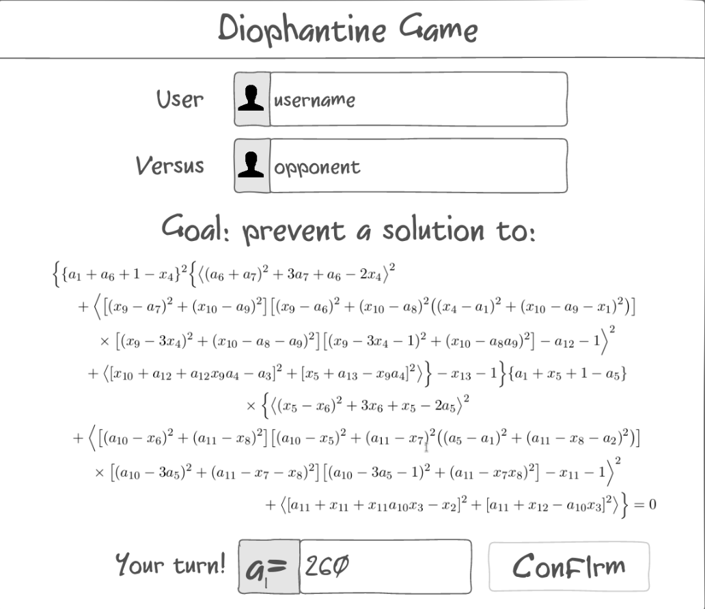

# Diophantine Game

## Description deliverable

### Elevator pitch

Have you ever found yourself reading about mathematical game theory, and wondering whether any implementation actually exists where you can play the game described? Maybe you were researching Hilbert's tenth problem and found an intriguing Diophantine game in which one of the players has a winning strategy which is not computable. Well, your search has now come to an end, since this convenient web app allows you to play this Diophantine game (and infinitely many more) conveniently online with your friends, with no need for tedious big integer calculations by hand! Two users join a game and alternately pick values for variables, with one player trying to make the final expression equal zero and the other trying to make it nonzero. If you just follow an algorithm, you can't have an optimal strategy, so if you can win every match you must be better than a computer ever could be!

### Design

### Key features

- Secure login over HTTPS
- Ability to specify an equation for play
- Ability to host and join game as players 1 and 2
- Ability to select arbitrary integer values for variables
- Displayed equation simplifies in real time as values are chosen
- Results are persistently stored and visible on a scoreboard
- Ability to save specific equations

### Technologies

I am going to use the required technologies in the following ways.

- **HTML** - Uses correct HTML structure for application. Three HTML pages. One for login, one for game setup, and one for gameplay.
- **CSS** - Application styling that looks good on different screen sizes, uses good whitespace, color choice and contrast.
- **JavaScript** - Provides login, choice display, applying variable substitutions, simplifying expressions, backend endpoint calls.
- **Service** - Backend service with endpoints for:
  - login
  - hosting a game
  - retrieving available games
  - joining a game
  - submitting value assigments
  - retrieving gameplay results
- **DB** - Store users, saved equations, and results in database.
- **Login** - Register and login users. Credentials securely stored in database. Can't save gameplay results or custom equations unless authenticated.
- **WebSocket** - As each user chooses a value, their choice is broadcast to their opponent.
- **React** - Application ported to use the React web framework.

## HTML deliverable

For this deliverable I added the application structure.

- **HTML pages** - Five HTML pages that represent the ability to login, join games, play games, see scores, and learn about the game.
- **Links** - The login page automatically links to the lobby page, which links to the play page. The play page contains links for choosing a number.
- **Text** - The game is explained with a textual description.
- **Images** - There is a picture from a paper in the about page.
- **Login** - Input box and submit button for login.
- **Database** - The scores represent data pulled from the database.
- **WebSocket** - The current equation state is determined in real time from the websocket.

## CSS deliverable

For this deliverable I properly styled the application into its final appearance.

- **Header, footer, and main content body**
- **Navigation elements** - I dropped the underlines and changed the color for anchor elements.
- **Responsive to window resizing** - My app looks great on most window sizes and devices, and the header and footer disappear if the window is too short
- **Application elements** - Used good contrast and whitespace
- **Application text content** - Consistent fonts
- **Application images** - Styled a bit around the historical paper screenshot
