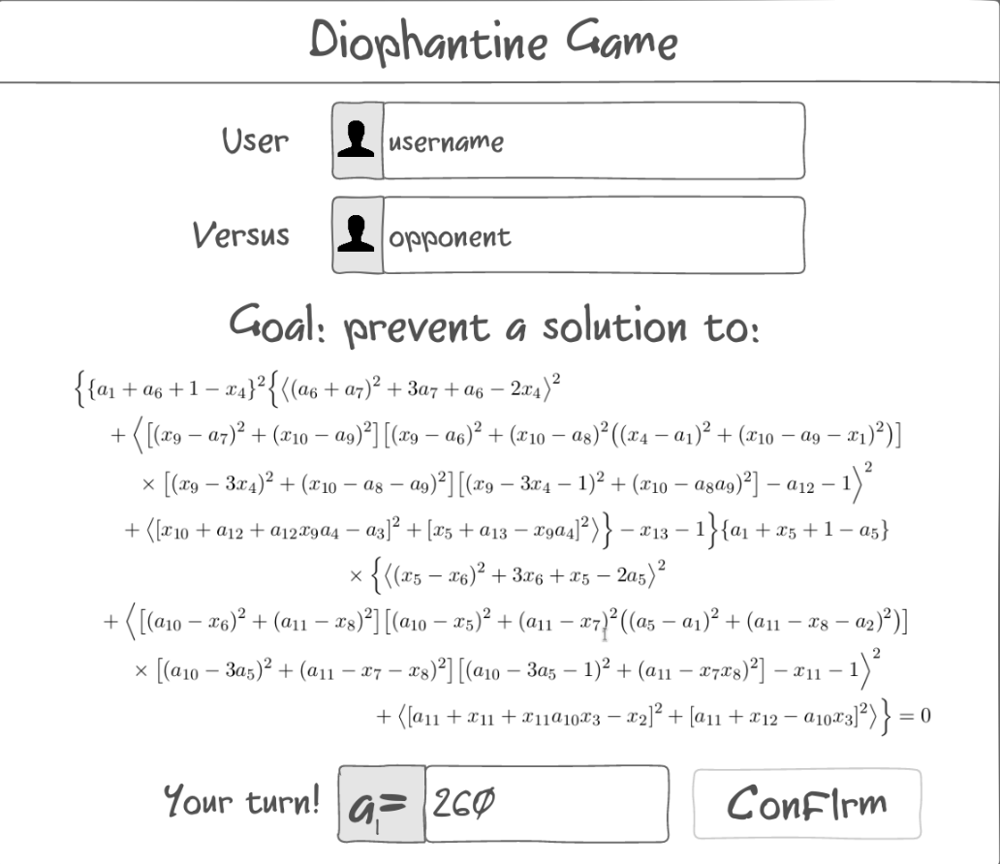

# Diophantine Game

## Description deliverable

### Elevator pitch

Have you ever found yourself reading about mathematical game theory, and wondering whether any implementation actually exists where you can play the game described? Maybe you were researching Hilbert's tenth problem and found an intriguing Diophantine game in which one of the players has a winning strategy which is not computable. Well, your search has now come to an end, since this convenient web app allows you to play this Diophantine game (and infinitely many more) conveniently online with your friends, with no need for tedious big integer calculations by hand! Two users join a game and alternately pick values for variables, with one player trying to make the final expression equal zero and the other trying to make it nonzero. If you just follow an algorithm, you can't have an optimal strategy, so if you can win every match you must be better than a computer ever could be!

<!-- $$\begin{align*}
\bigg\{ \{a_1 + a_6 + 1 - x_4 \}^2 \bigg\{ \big\langle (a_6 + a_7)^2 + &3a_7 + a_6 - 2x_4 \big\rangle^2 \\
  + \bigg\langle [ (x_9 - a_7)^2 + (x_{10} - a_9)^2 ] [ (&x_9 - a_6)^2 + (x_{10} - a_8)^2 ( (x_4 - a_1)^2 + (x_{10} - a_9 - x_1)^2 ) ] \\
  \times [ (x_9 - 3x_4)^2 + (x_{10} - a_8 - &a_9)^2 ] [ (x_9 - 3x_4 - 1)^2 + (x_{10} - a_8 a_9)^2 ] - a_{12} - 1 \bigg\rangle^2 \\
  + \langle [ x_{10} + a_{12} + a_{12} x_9 a_4 - a_3 ]^2 &+ [ x_5 + a_{13} - x_9 a_4 ]^2 \rangle \bigg\} - x_{13} - 1 \bigg\} \{ a_1 + x_5 + 1 - a_5 \} \\
  \times \bigg\{ \langle ( &x_5 - x_6)^2 + 3x_6 + x_5 - 2a_5 \rangle^2 \\
  + \bigg\langle [ ( a_{10} - x_6 )^2 + (a_{11} - x_8)^2 ] [ (&a_{10} - x_5)^2 + (a_{11} - x_7)^2 ( (a_5 - a_1)^2 + (a_{11} - x_8 - a_2)^2 ) ] \\
  \times [ (a_{10} - 3a_5)^2 + (a_{11} - x_7 - &x_8)^2] [ (a_{10} - 3a_5 - 1)^2 + (a_{11} - x_7 x_8)^2 ] - x_{11} - 1 \bigg\rangle^2 \\
  + \langle &[ a_{11} + x_{11} + x_{11} a_{10} x_3 - x_2 ]^2 + [a_{11} + x_{12} - a_{10} x_3 ]^2 \rangle \bigg\} = 0        \end{align*}$$ -->

### Design

### Key features

- Secure login over HTTPS
- Ability to specify an equation for play
- Ability to host and join game as players 1 and 2
- Ability to select arbitrary integer values for variables
- Displayed equation simplifies in real time as values are chosen
- Results are persistently stored and visible on a scoreboard
- Ability to save specific equations

### Technologies

I am going to use the required technologies in the following ways.

- **HTML** - Uses correct HTML structure for application. Three HTML pages. One for login, one for game setup, and one for gameplay.
- **CSS** - Application styling that looks good on different screen sizes, uses good whitespace, color choice and contrast.
- **JavaScript** - Provides login, choice display, applying variable substitutions, simplifying expressions, backend endpoint calls.
- **Service** - Backend service with endpoints for:
  - login
  - hosting a game
  - retrieving available games
  - joining a game
  - submitting value assigments
  - retrieving gameplay results
- **DB** - Store users, saved equations, and results in database.
- **Login** - Register and login users. Credentials securely stored in database. Can't save gameplay results or custom equations unless authenticated.
- **WebSocket** - As each user chooses a value, their choice is broadcast to their opponent.
- **React** - Application ported to use the React web framework.

## HTML deliverable

For this deliverable I added the application structure.

- **HTML pages** - Five HTML pages that represent the ability to login, join games, play games, see scores, and learn about the game.
- **Links** - The login page automatically links to the lobby page, which links to the play page. The play page contains links for choosing a number.
- **Text** - The game is explained with a textual description.
- **Images** - There is a picture from a paper in the about page.
- **Login** - Input box and submit button for login.
- **Database** - The scores represent data pulled from the database.
- **WebSocket** - The current equation state is determined in real time from the websocket.

## CSS deliverable

For this deliverable I properly styled the application into its final appearance.

- **Header, footer, and main content body**
- **Navigation elements** - I dropped the underlines and changed the color for anchor elements.
- **Responsive to window resizing** - My app looks great on most window sizes and devices, and the header and footer disappear if the window is too short
- **Application elements** - Used good contrast and whitespace
- **Application text content** - Consistent fonts
- **Application images** - Styled a bit around the historical paper screenshot

## JavaScript deliverable

For this deliverable I made my application functional for the user to input variable assignments which then update the equation.

- **Login** - When you click the login button it stores the username takes you to the lobby page.
- **Database** - Displayed the user scores of games. Currently this is stored and retrieved from local storage, but it will be replaced with the database data later. Also there is a list of currently open games stored and shown in the lobby.
- **WebSocket** - I used delays to asynchronously simulate the opponent's moves. This will be replaced with WebSocket messages later.
- **Application logic** - The equation dynamically updates and simplifies based on the user's and opponent's selections.

## Service deliverable

For this deliverable I created an HTTP service to host my frontend and provide backend endpoints.

- **Node.js/Express HTTP service** - done!
- **Static middleware for frontend** - done!
- **Calls to third party endpoints** - I simulate waiting on the opponent now with an API call to [random.org](https://www.random.org).
- **Backend service endpoints** - Endpoints for querying and updating scores. Also, a framework for keeping track of and querying for active games.
- **Frontend calls service endpoints** - I did this using the `fetch` function.

## DB deliverable

For this deliverable I stored and retrieved data from MongoDB.

- **MongoDB Atlas database created** - done!
- **Endpoints for data** - My endpoints now store data in and retrieve data from MongoDB.
- **Stores data in MongoDB** - done!

## Login deliverable

For this deliverable I added user registration and authentication.

- **User registration** - Creates a new account in the database.
- **Existing user** - Verifies the user's name and password from data stored in the database
- **Use MongoDB to store credentials** - done!
- **Restricts functionality** - You cannot play until you have logged in.

## WebSocket deliverable

For this deliverable I enabled realtime reporting of games from other users.

- **Backend listens for WebSocket connection** - done!
- **Frontend makes WebSocket connection** - done!
- **Data sent over WebSocket connection** - done!
- **WebSocket data displayed** - Game data displays in realtime and users now play with each other instead of a random number generator

## React deliverable

For this deliverable I converted the application over to use React.

- **Bundled and transpiled** - done!
- **Components** - `Login`, `Lobby`, `Play`, `Scores`, and `About` are all components.
- **Router** - Routing between all components, and particularly from `Lobby` to `Play`.
- **Hooks** - `Play` uses hooks extensively to propagate game information to all components in real time, and other components display data after asynchronous operations.
